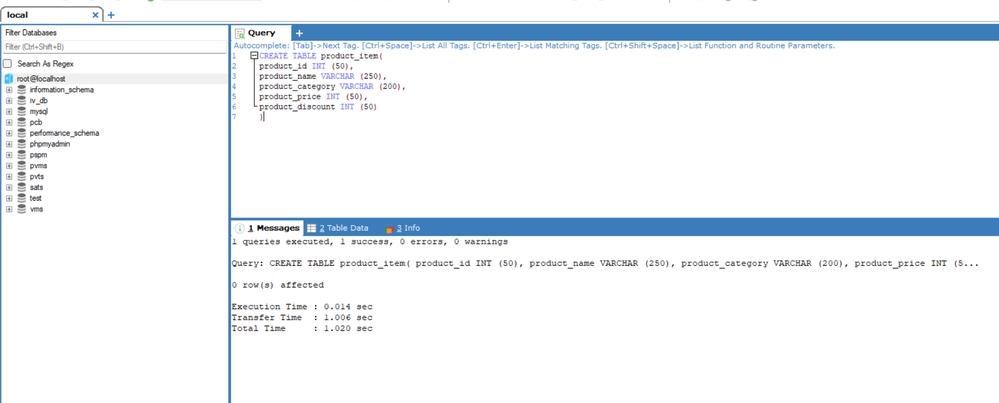

# Task - Creating and Populating Tables

- To create a database named `Products` and add list of products by creating the table `product_item` and perform a `selection` to verfiy the data inserted to it.

## Creating a Database.

```
CREATE DATABASE products;
```

- It will creates a database named `products`.


```
CREATE TABLE product_item(
product_id INT (50),
product_name VARCHAR (250),
product_category VARCHAR (200),
product_price INT (50),
product_discount INT (50)
)
```

- Create a table named `product_items` with column attributes of `product_id`, `product_name`, `product_category`, `product_price` and `product_discount`.



```
INSERT INTO product_item(product_id,product_name,product_category,product_price,product_discount) VALUES 
(1,"Asus Laptop", "Electronics", 50000,2000),
(2,"Samsung Fold 14", "Electronics", 350000,2000),
(3,"Andrioid TV 22Inches", "Electronics",22000,1000),
(4,"Study Table 40x20 Inches","Wood Materials",5000,1000),
(5,"Cartoon Coloring Book", "Books",2000,200)
```

- To insert the multiple records of data into the `product_items` table.


```
SELECT * FROM product_item;
```

- It will selects all the column data from `product_items` table.

