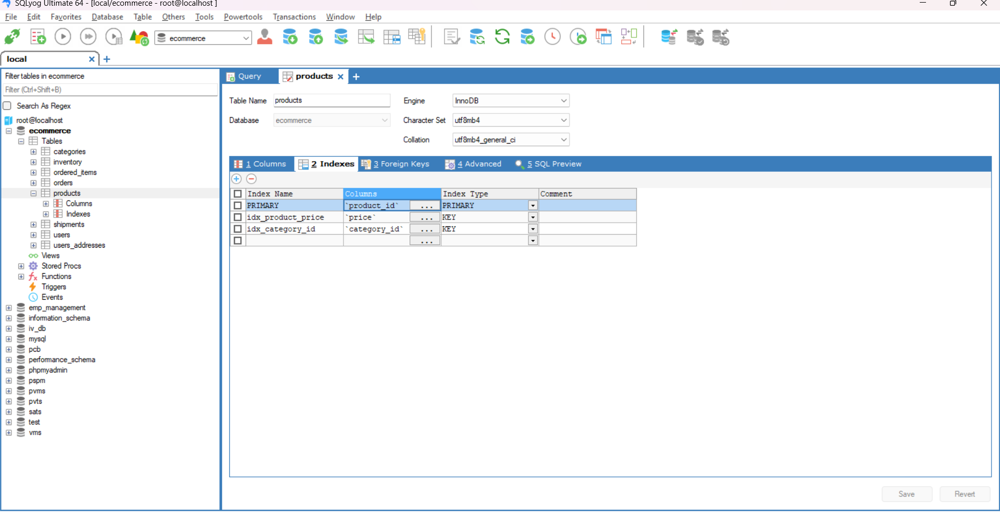

# Task - Creating a Ecommerce Database and working with Indexing, Triggers, Transcations and Views.

- Create a Ecommerece Database with multiple tables such as `users`,`orders`,`products`,`inventory` etc and perform a Indexing, create a triggers and working with transcations and views.

## Database Schema

- Created a database named `ecommerce` to work on this task.
- This ecommerce database contains the tables such as `users`, `user_addresses`, `inventory`, `ordered_items`, `shipments`,and `products`.
- Below figure shows the schema of the database tables.


- Flow of the above database schema is like below.
  1.A user places an order. 2. The order is linked to a shipping address. 3. The order contains ordered items (multiple products). 4. A shipment is created for the order. 5. The inventory for each product is updated. 6. Products are grouped under categories.

## Database Relationships

| Table Name        | Foreign Key Reference                         | Description                              |
| ----------------- | --------------------------------------------- | ---------------------------------------- |
| `users_addresses` | `users.user_id`                               | Multiple addresses per user              |
| `orders`          | `users.user_id`, `users_addresses.address_id` | Orders are linked to users and addresses |
| `ordered_items`   | `orders.order_id`, `products.product_id`      | Items linked to both orders and products |
| `shipments`       | `orders.order_id`                             | Shipment linked to a specific order      |
| `products`        | `categories.category_id`                      | Each product belongs to a category       |
| `inventory`       | `products.product_id`                         | Tracks stock per product                 |

## SQL Index

- An index is like a table of contents for our database. It helps SQL quickly locate rows without scanning the entire table.

## Types of Indexing

1. `Primary Index` – Automatically created on the PRIMARY KEY.
2. `Unique Index` – Ensures no duplicate values (used on email, etc.).
3. `Composite Index` – Index on multiple columns (e.g., (user_id, order_date)).
4. `Full-text Index` – For searching large text fields (product.description).
5. `Foreign Key Index` – Often implicitly indexed, but not always.

## Indexing Performed on Database

- In users table indexing is performed on `email` and `role` attributes to faster the selection process based on where conditions.
- Index on email (for login queries).
- Index on role if filtering admins/customers.

`CREATE INDEX idx_users_email ON users(email);
CREATE INDEX idx_users_role ON users(role);`

- To know about how the query is executed and whether an index is being used. Below SQL quey helps to identify that.

```
EXPLAIN SELECT * FROM orders WHERE user_id = 'USR001';

```




## When to use Indexing

- `Optimize Search & Filtering:` Use indexes on frequently queried columns like `email`, `username`, `product_id`, and order_date to speed up `WHERE`, `BETWEEN`, and `ORDER BY` queries.

- `Enhance JOIN Performance:` Index foreign key columns (e.g., `user_id`, `product_id`) to improve efficiency in `JOIN` operations.

## Triggers

- A trigger is a piece of SQL code that automatically runs in response to certain events (like `INSERT`, `UPDATE`, or `DELETE`) on a table.

## Triggering Events

| Event    | Description                           |
| -------- | ------------------------------------- |
| `BEFORE` | Runs before the data modification.    |
| `AFTER`  | Runs after the data modification.     |
| `INSERT` | Triggered when a new row is inserted. |
| `UPDATE` | Triggered when a row is updated.      |
| `DELETE` | Triggered when a row is deleted.      |

## Trigger Example

- Performed a trigger on `inventory` and `ordered_items` tables.
- When a new order is placed (insereted) on `ordered_items` then the `update_inventory_after_order` trigger will automatically updates the stock quantity on `inventory` table.
- This will automatically run every time a new item is added to `ordered_items` and update stock in `inventory` table.

```
CREATE TRIGGER update_inventory_after_order
AFTER INSERT ON order_items
FOR EACH ROW
BEGIN
  UPDATE inventory
  SET stock = stock - NEW.quantity
  WHERE product_id = NEW.product_id;
END;
```

## Transcations

- A transaction is a group of SQL operations executed as a single unit.
- It ensures data integrity by guaranteeing that all steps succeed or none at all.

## Key Commands of Transactions

| Command    | Description                         |
| ---------- | ----------------------------------- |
| `BEGIN`    | Starts a transaction block          |
| `COMMIT`   | Saves all changes permanently       |
| `ROLLBACK` | Undoes all changes made since BEGIN |

## Example of Transcation

- Below SQL Transcation is an example of order precessing in ecommerec.
- Initially it Inserts new order in the `orders` table.
- After inserting a new order it will Get the last inserted `order_id` from `orders` table.
- Then it will add items to `ordered_items` table.
- Update inventory and if every execution goes without any error then changes will saved by `COMMIT`.
- Or else it will `ROLLBACK` and undo all previous changes in the transaction.

```
START TRANSACTION;

INSERT INTO orders (user_id, order_date, status)
VALUES (101, NOW(), 'Processing');

SET @order_id = LAST_INSERT_ID();

INSERT INTO order_items (order_id, product_id, quantity)
VALUES
(@order_id, 5, 2),
(@order_id, 8, 1);

UPDATE inventory SET stock = stock - 2 WHERE product_id = 5;
UPDATE inventory SET stock = stock - 1 WHERE product_id = 8;

COMMIT;
```

## SQL Views

- A view is a virtual table based on a SQL query.
- It does not store data itself. It pulls data from other tables.
- Views hepls to reuse, simplify, and secure data access.

## Example of View

- Creating a view that shows order summary from ecommerce tables.
- Below SQL View Query is named as `order_summary` which shows the order summary for each customers.
- It uses three tables such as `orders`, `ordered_items` and `users` table to summary the data.
- Final result will be `order_id`, `user_id`, `user_name`, `ordered_date` and `total_items` ordered for each customers.

```
CREATE VIEW order_summary AS
SELECT
    o.order_id,
    o.user_id,
    u.user_name AS customer_name,
    o.ordered_date,
    SUM(oi.quantity) AS total_items
FROM orders o
JOIN users u ON o.user_id = u.user_id
JOIN ordered_items oi ON o.order_id = oi.order_id
GROUP BY o.order_id, o.user_id, u.user_name, o.ordered_date;
```


- To view the usage of views we can execute the below sql query as sample and we get a response as faster.

```
SELECT * FROM order_summary WHERE user_id = "USR003";
```


## Materialized View

- A materialized view is like a view, but stores the query result physically.
- It’s useful for expensive operations like complex joins or aggregations.
- Below Materialized view shows the user wise total sales or order data.

```
CREATE MATERIALIZED VIEW monthly_sales AS
SELECT 
    user_id,
    MONTH(order_date) AS month,
    SUM(total_amount) AS total_sales
FROM orders
GROUP BY user_id, MONTH(order_date);
```

## Summarization

- In this task we have performed the following parts of SQL topics in Ecommerce Database for Hands on Expirience.

- Database Design & Normalization
    - Designed a normalized schema for an eCommerce platform including tables like users, products, categories, orders, order_items, inventory, addresses, and more.

- Indexing for Performance
    - Explored primary, unique, composite, foreign key, and full-text indexes to optimize queries and enforce constraints.

- Triggers
    - Implemented triggers to automatically update inventory changes upon insert or update operations.

- Transactions
    - Ensured data consistency using BEGIN, COMMIT, and ROLLBACK in multi-step operations like order placement.

- Views
    - Created SQL views to simplify complex aggregations and joins, understood when and why to use views vs raw queries.

