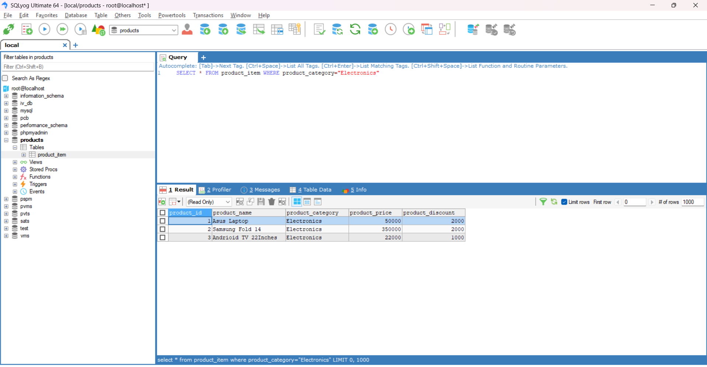
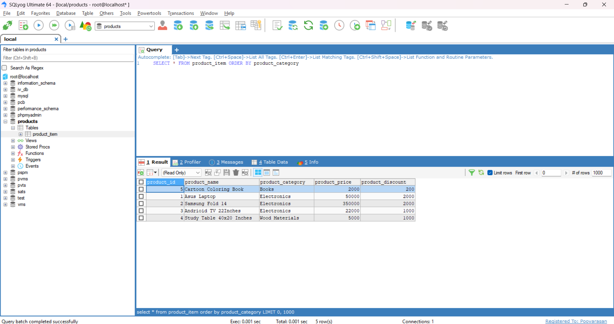
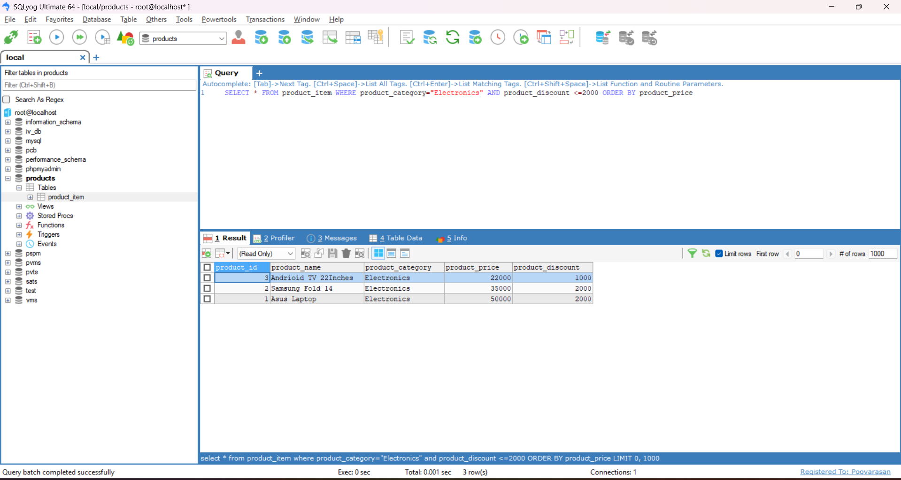

## Task - Basic Filtering and Sorting

- working with sorting and filtering of records in the table.

## SQL Scripts

```
SELECT * FROM product_item WHERE product_category="Electronics"
```

- It will selects the rows from `product_item` table using `WHERE` clause to filter the record where `product_category` equals to `Electronics`.



```
SELECT * FROM product_item ORDER BY product_category
```

- It will selects all the rows from the `product_item` table and sort them using a `ORER BY` clause based on product category.




```
SELECT * FROM product_item WHERE product_category="Electronics" AND product_discount <=2000 ORDER BY product_price
```

- It will selects the table row records from the `product_item` table using mulitple conditions. It selects the record where `product_category` are equal to `Electronics` and `product_discount` less than or equal to 2000 and sorts them based on `product_price`.

