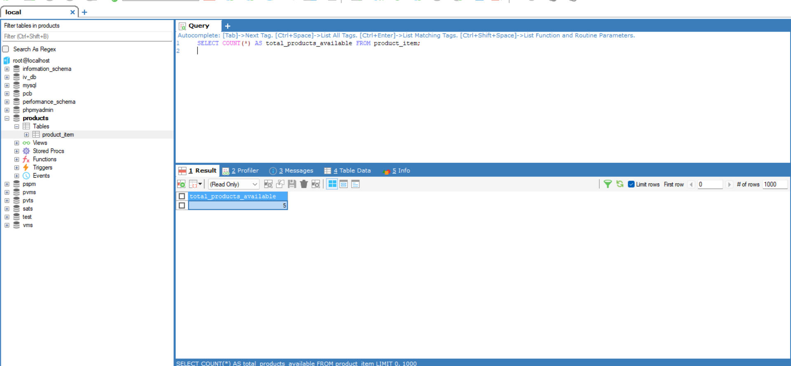
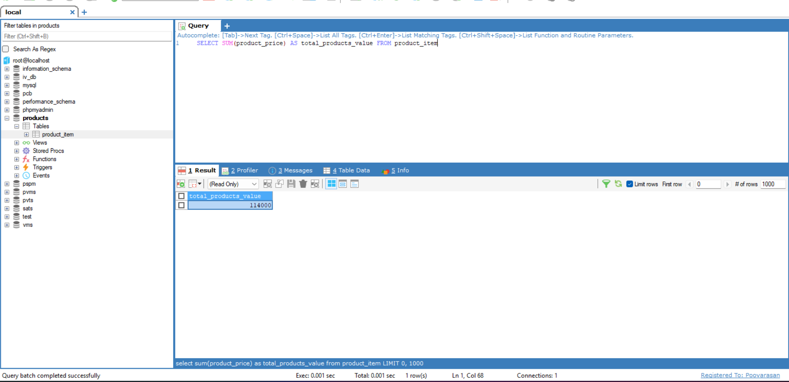
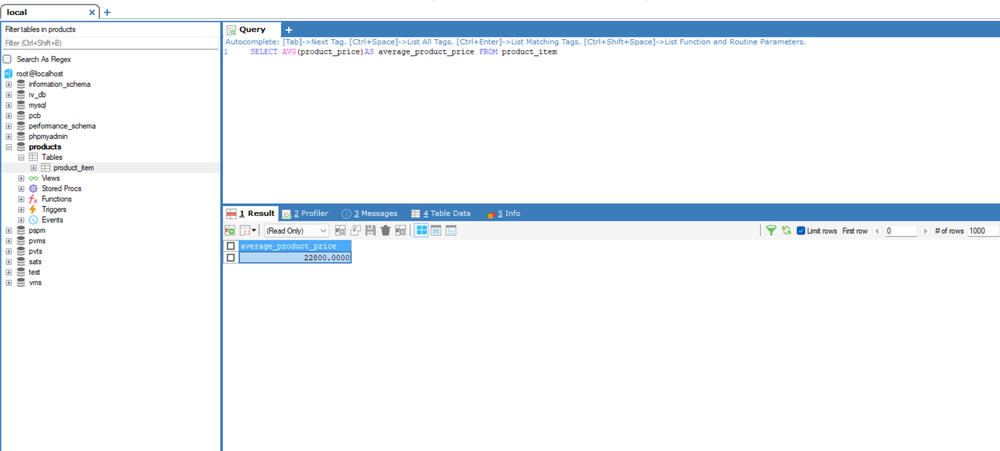
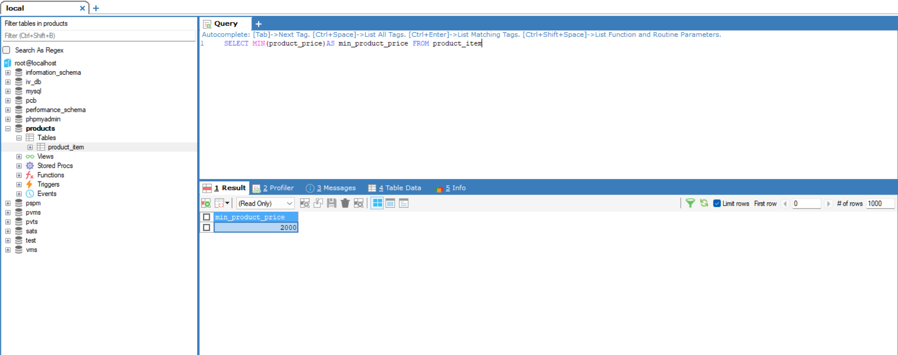
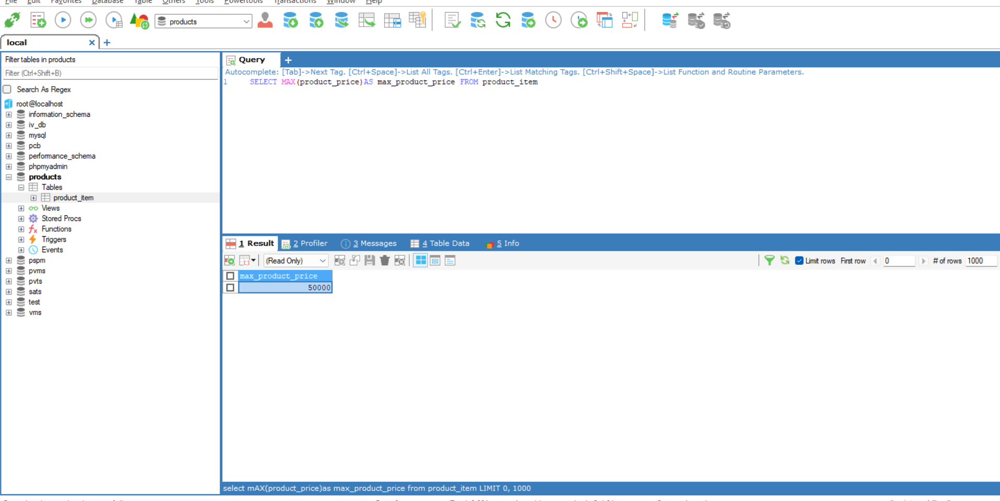
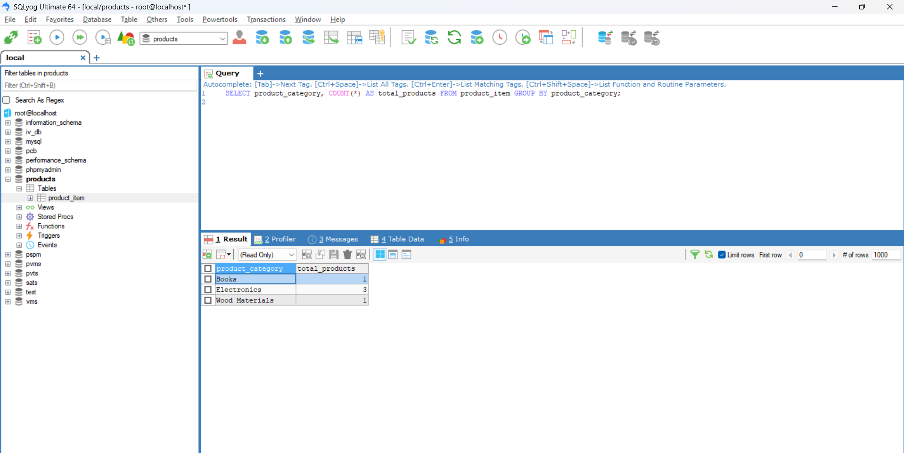

# Task - Simple Aggregation and Grouping

- Working with SQL Aggregation and Grouping function with sample ecommerce products table.

## SQL Queries

1. Aggregation

- Aggregation means combining multiple rows of data into a single summary value using aggregate functions.


```
SELECT COUNT(*) AS total_products_available FROM product_item;
```

- Count the total number of products available in the `product_item` table using `COUNT()` aggregate function.



```
SELECT SUM(product_price) AS total_products_value FROM product_item
```

- Calculate the total value of all products in the `product_item` table using `SUM()` aggregate function.



```
SELECT AVG(product_price)AS average_product_price FROM product_item
```

- Calculate the average price from the `product_item` table using `AVG()` aggregate function.




```
SELECT MIN(product_price)AS min_product_price FROM product_item
```
- Find the minimum price from the `product_item` table using `MIN()` aggregate function.




```
SELECT MAX(product_price)AS max_product_price FROM product_item
```
- Find the maximum price from the `product_item` table using `MAX()` aggregate function.




2. Group BY

- GROUP BY is used with aggregation to group rows based on one or more columns, and then apply aggregate functions to each group.

```
SELECT product_category, COUNT(*) AS total_products FROM product_item GROUP BY product_category;
```
- Find the total number of products in each category from the product_item table

