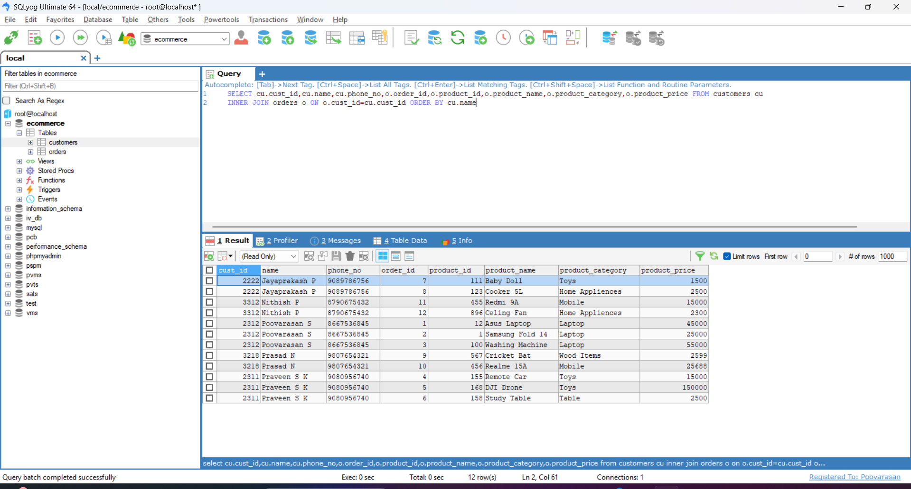
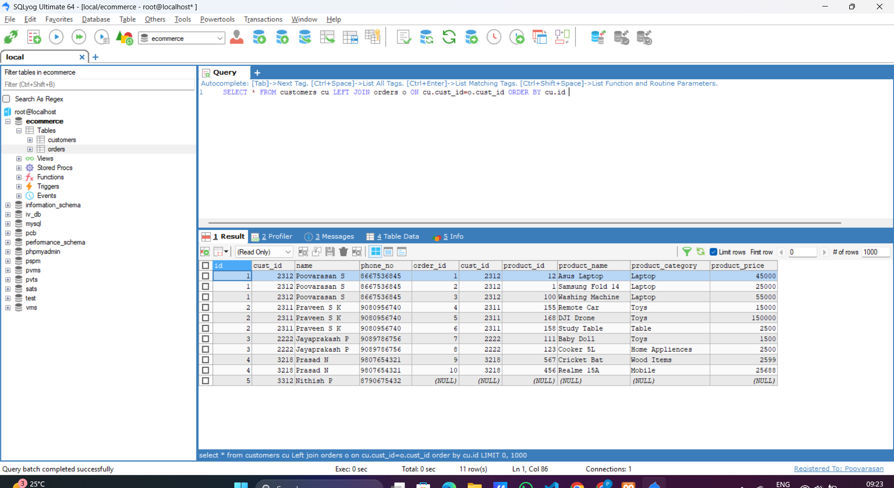
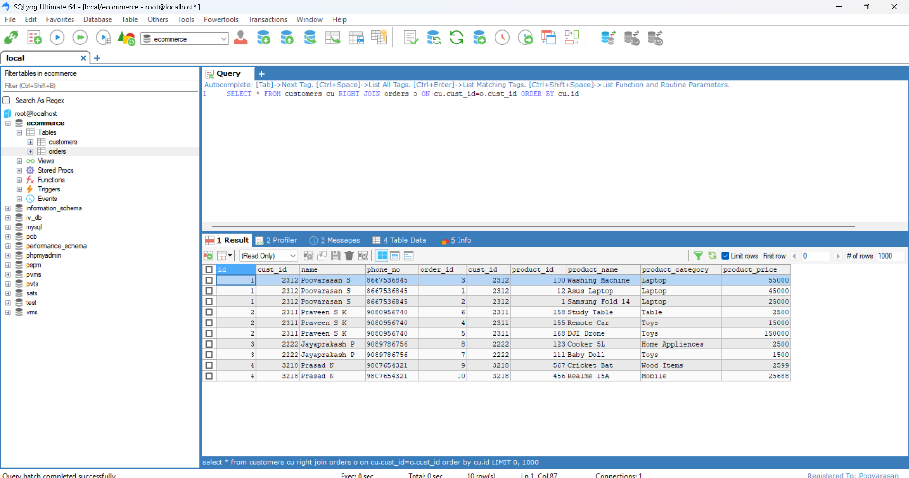
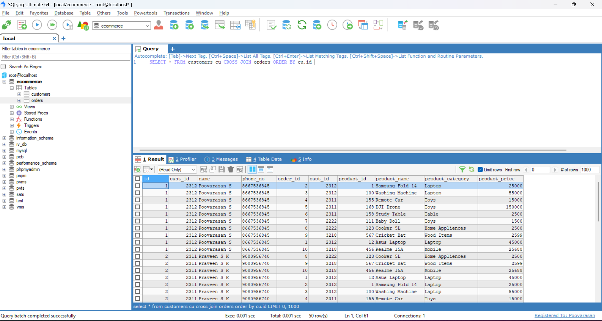
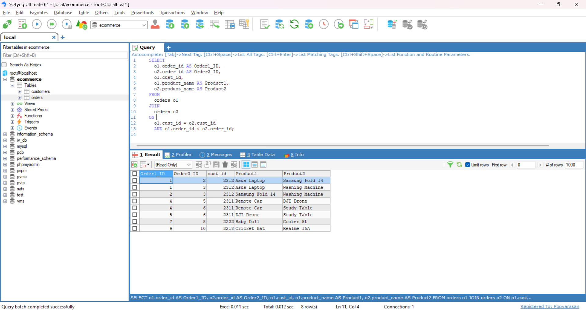

# Task - Working SQL Joins

- Create a Ecommerce table and work with SQL joins like `INNER` join, `LEFT` and `RIGHT` join etc.

## SQL Joins.

- JOINs are used to combine rows from two or more tables based on a related column between them. Here are the most common types of JOINs:

    1. Inner Join
    2. Left Join
    3. Rigth Join
    4. Full Join or Union
    5. Cross Join
    6. Self Join

## INNER JOIN

- This join will returns the matching records on both `customers` and `orders` table.

```
SELECT cu.cust_id,cu.name,cu.phone_no,o.order_id,o.product_id,o.product_name,o.product_category,o.product_price FROM customers cu 
INNER JOIN orders o ON o.cust_id=cu.cust_id ORDER BY cu.name
```




## LEFT JOIN

- Returns all records from the left table, and the matched records from the right table. If no match, NULLs in right table columns.

```
SELECT * FROM customers cu LEFT JOIN orders o ON cu.cust_id=o.cust_id ORDER BY cu.id 
```




## RIGHT JOIN 

- Returns all records from the right table, and the matched records from the left table. If no match, NULLs in left table columns.

```
SELECT * FROM customers cu RIGHT JOIN orders o ON cu.cust_id=o.cust_id ORDER BY cu.id 
```




## FULL JOIN

- Returns all records when there is a match in either left or right table. If there's no match, NULLs are shown in columns from the table without the match.

- It is not supported in some databases like MySQL (we can emulate with UNION of LEFT and RIGHT joins).

## CROSS JOIN

- It will returns a Cartesian product, all possible combinations of rows from both tables.

```
SELECT * FROM customers cu CROSS JOIN orders ORDER BY cu.id 
```



## SELF JOIN 

- This query compares all pairs of orders made by the same customer, showing combinations where the first order's ID is less than the second to avoid duplicates and self-pairing.

```
SELECT o1.order_id AS Order1_ID, o2.order_id AS Order2_ID, o1.cust_id, o1.product_name AS Product1, o2.product_name AS Product2 FROM 
orders o1 JOIN orders o2 ON o1.cust_id = o2.cust_id AND o1.order_id < o2.order_id;
```

