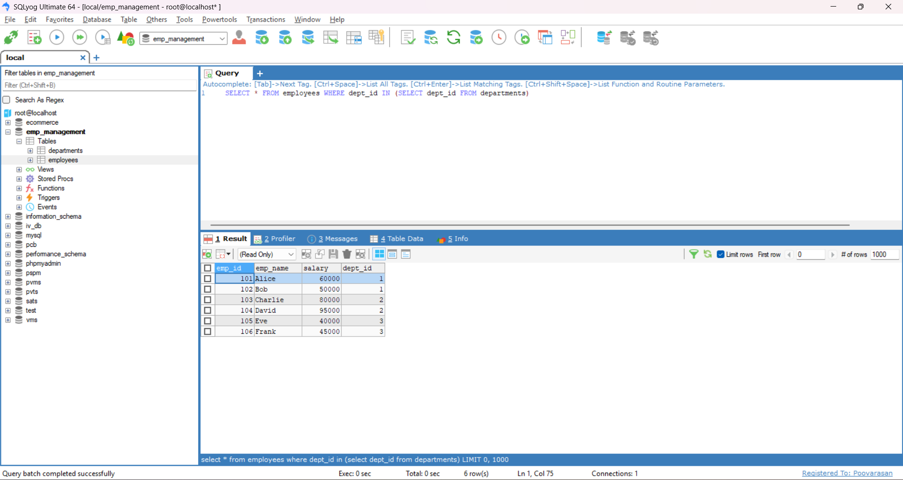
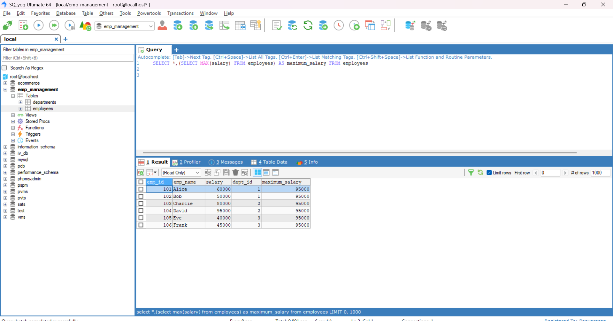
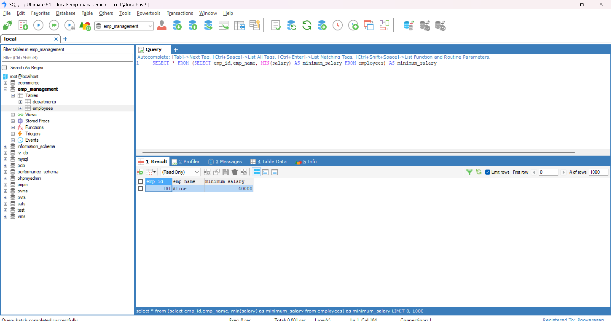

# Task - Working with Subquery or Nested query

- Working with a subquery to perform table data retrival using a different type of clauses like `SELECT`,`WHERE` and `FROM`.

## What is Subquery?

- A subquery (or nested query) is a query inside another query.
- It can be used in `SELECT`, `FROM`, or `WHERE` clauses.
- The inner query runs first, and its result is used by the outer query.

## Types of Subqueries

1. Subquery in WHERE clause
2. Subquery in SELECT clause
3. Subquery in FROM clause

## Subquery in WHERE Clause

- A subquery in the `WHERE` clause filters records from the outer query based on the result of the subquery.
- Below SQl Subquery will return the records of employees table based on the departments present in the `WHERE` condition.

```
SELECT * FROM employees WHERE dept_id IN (SELECT dept_id FROM departments)
```



## Subquery in SELECT Clause

- A subquery in the SELECT clause is used to compute a value for each row, and add it as a column in the result.
- Below SQL Subquery will finds the maximum salary from the employees table and add it to the returned table records.

```
SELECT *,(SELECT MAX(salary) FROM employees) AS maximum_salary FROM employees
```



## Subquery in FROM Clause

- A subquery in the FROM clause is treated like a temporary table (also called a derived table). The outer query works on this result.
- Below SQL Subquery will selects the min salaried employee details by acting as a temporary table.

```
SELECT * FROM (SELECT emp_id,emp_name, MIN(salary) AS minimum_salary FROM employees) AS minimum_salary
```


