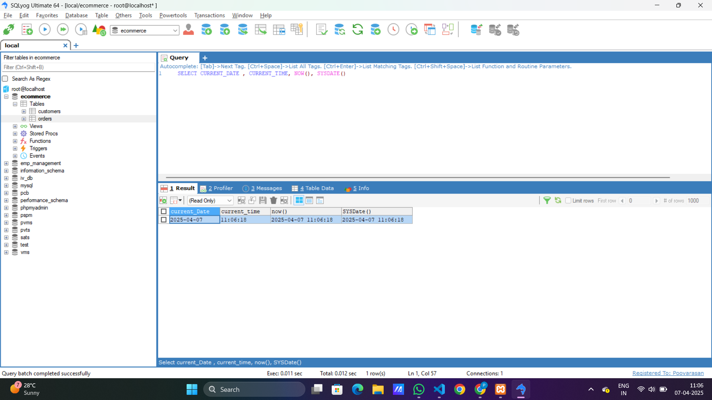
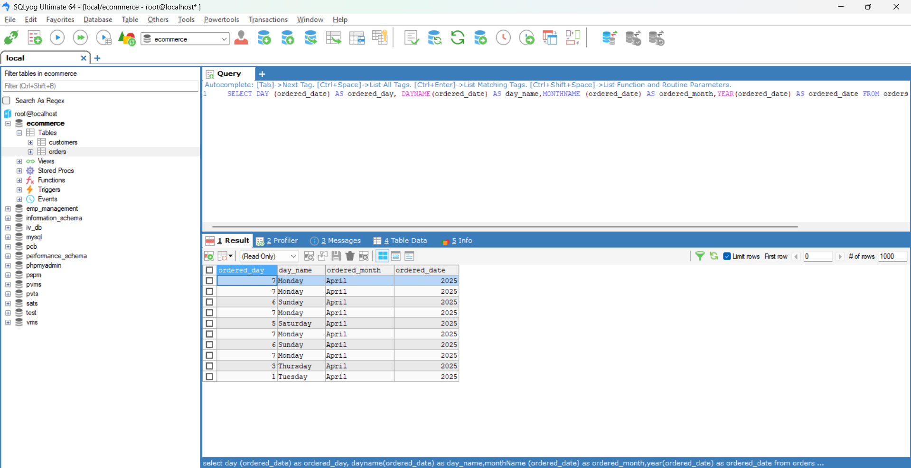
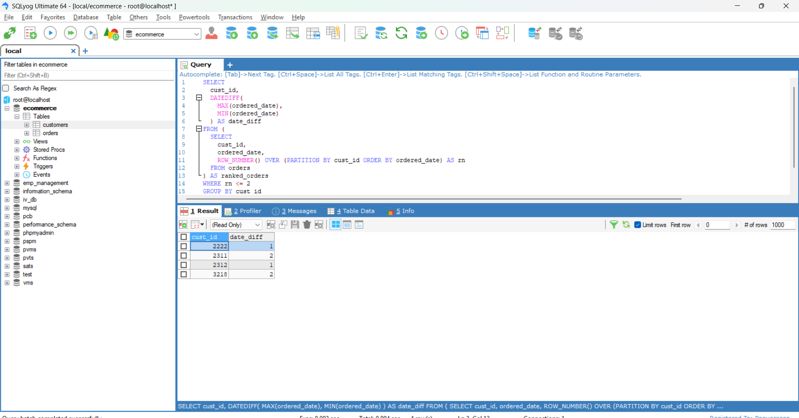
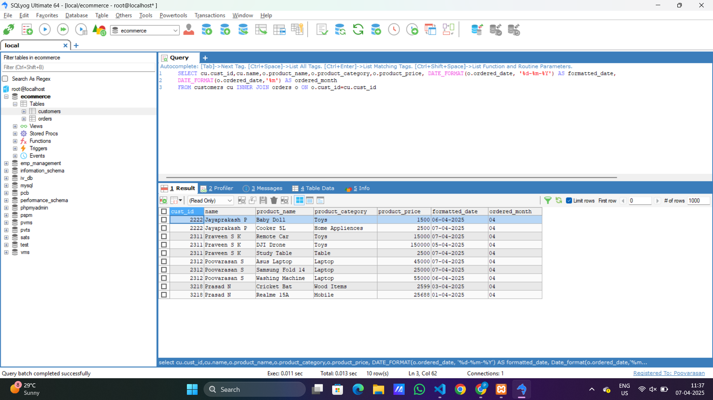

# Task - Working with Date and Time functions

- Manipulate and query data based on date and time values.

## Current Date and Time Functions

- This functions are used to work on current date and time retrival of the table and system. Here is the some commom function used in our development life.

| Function       | Description                 | Example                |
| -------------- | --------------------------- | ---------------------- |
| `CURRENT_DATE` | Returns current date        | `SELECT CURRENT_DATE;` |
| `CURRENT_TIME` | Returns current time        | `SELECT CURRENT_TIME;` |
| `NOW()`        | Returns current date & time | `SELECT NOW();  `      |
| `SYSDATE()`    | Returns system date & time  | `SELECT SYSDATE();`    |

- Below sql query and figure shows that how the current date and time function works and output of the above functions.

```
SELECT CURRENT_DATE,CURRENT_TIME, NOW(), SYSDATE();
```



## Date Extraction Functions

- The date extraction functions helps to extract month, year, date, day and name of the month,day etc.

| Function          | Description               | Example                           |
| ----------------- | ------------------------- | --------------------------------- |
| `YEAR(date)`      | Extracts year from a date | `SELECT YEAR('2025-04-07');`      |
| `MONTH(date)`     | Extracts month            | `SELECT MONTH('2025-04-07');`     |
| `DAY(date)`       | Extracts day              | `SELECT DAY('2025-04-07');   `    |
| `DAYNAME(date)`   | Gets weekday name         | `SELECT DAYNAME('2025-04-07'); `  |
| `MONTHNAME(date)` | Gets month name           | `SELECT MONTHNAME('2025-04-07');` |

- Below sql query shows that how Date Extraction functions helps in realtime database table.
- It will return the `DAY`,`DAYNAME`,`MONTH`,`YEAR` based on `ordered_date` from the `orders` table.

```
SELECT DAY (ordered_date) AS ordered_day, DAYNAME(ordered_date) AS day_name,MONTHNAME (ordered_date) AS ordered_month,YEAR(ordered_date) AS ordered_date FROM orders
```



## Date Arithmetic

| Function                     | Description                      | Example                                            |
| ---------------------------- | -------------------------------- | -------------------------------------------------- |
| `DATE_ADD(date, INTERVAL x)` | Adds days/months/years to date   | `SELECT DATE_ADD('2025-04-07', INTERVAL 10 DAY); ` |
| `DATE_SUB(date, INTERVAL x)` | Subtracts interval from date     | `SELECT DATE_SUB('2025-04-07', INTERVAL 2 MONTH);` |
| `DATEDIFF(date1, date2) `    | Difference in days between dates | `SELECT DATEDIFF('2025-04-07', '2025-01-01');`     |

- Below sql query will return the date difference of a customers 1st and 2nd order based on ordered date.

```
SELECT cust_id, DATEDIFF(MAX(ordered_date),MIN(ordered_date)) AS date_diff FROM ( SELECT cust_id,ordered_date,ROW_NUMBER() OVER (PARTITION BY cust_id ORDER BY ordered_date) AS rn FROM orders) AS ranked_orders
WHERE rn <= 2 GROUP BY cust_id HAVING COUNT(*) = 2;
```



## Formatting Dates

- It is used to format the dates to any time type of format that we like to use.

| Function                    | Description                     | Example                                           |
| --------------------------- | ------------------------------- | ------------------------------------------------- |
| `DATE_FORMAT(date, format)` | Formats date into custom string | `SELECT DATE_FORMAT(NOW(), '%d-%m-%Y %H:%i:%s');` |

- Below SQL query is the example for formatting the dates. It will format the ordered date to show date, month of the orders separately.

```
SELECT cu.cust_id,cu.name,o.product_name,o.product_category,o.product_price, DATE_FORMAT(o.ordered_date, '%d-%m-%Y') AS formatted_date,
DATE_FORMAT(o.ordered_date,'%m') AS ordered_month
FROM customers cu INNER JOIN orders o ON o.cust_id=cu.cust_id
```

