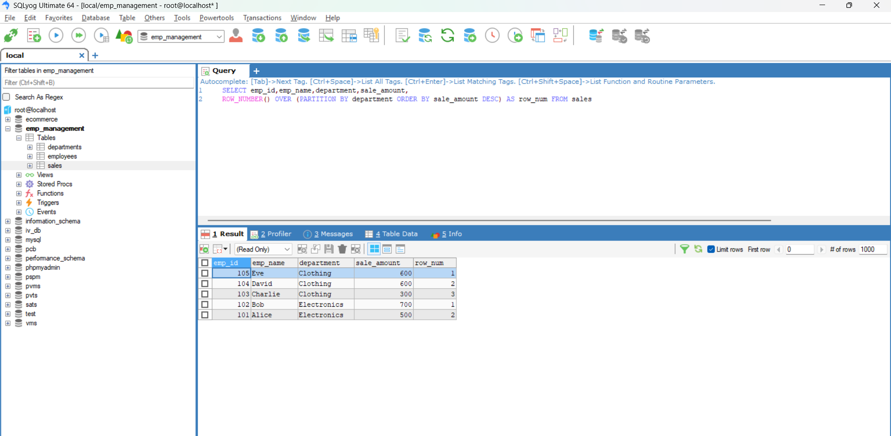
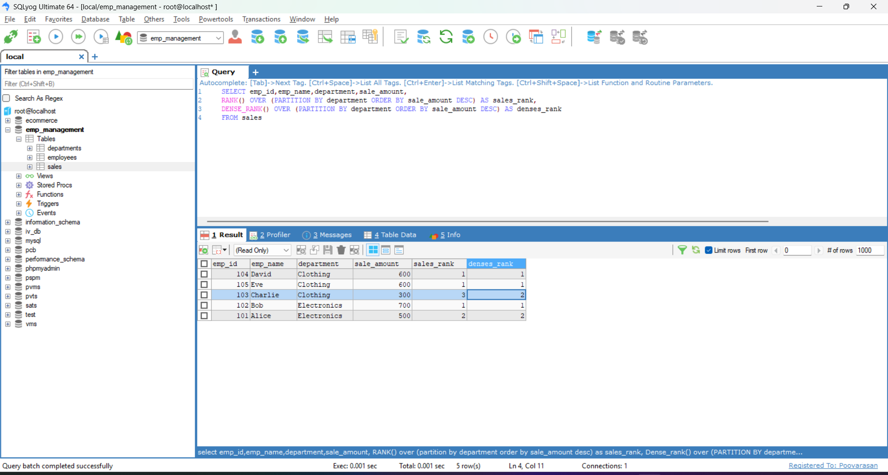
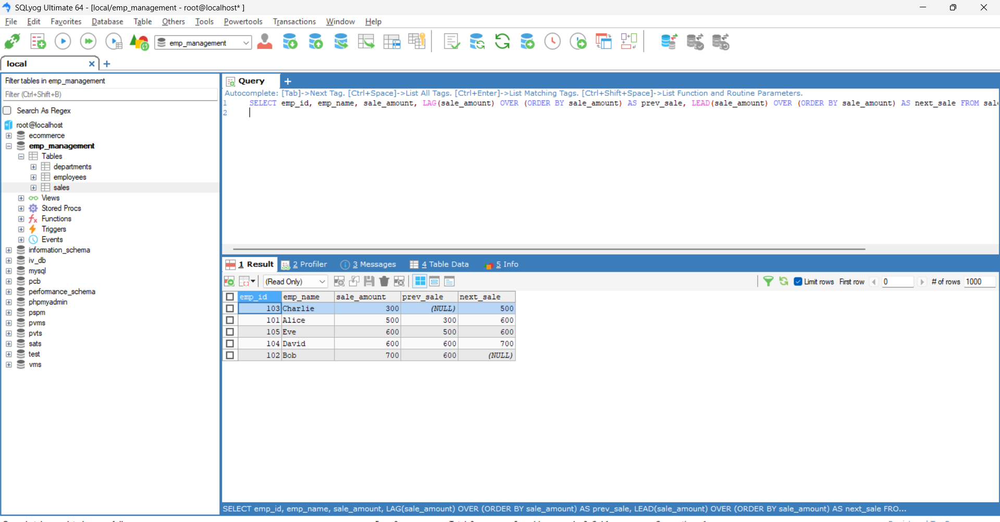
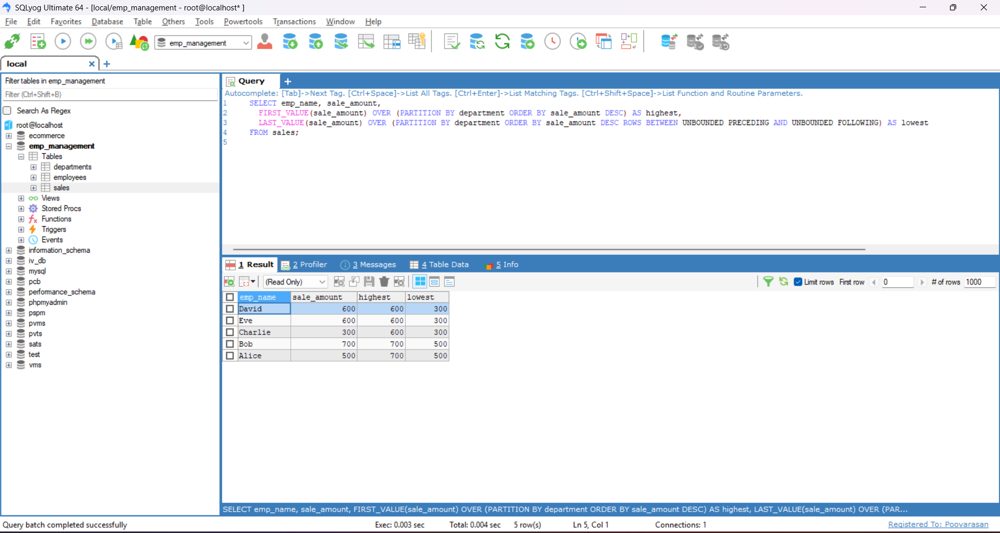

# Task - Working with Window Functions

- SQL Window Functions are used to perform calculations across a set of rows related to the current row, without collapsing the result like GROUP BY. These functions are powerful for analytics, reporting, and comparisons.

## Ranking Functions

| Function       | Description                                   |
| -------------- | --------------------------------------------- |
| `ROW_NUMBER()` | Gives a unique sequential number to each row. |
| `RANK()`       | Same rank for ties, skips next ranks.         |
| `DENSE_RANK()` | Same rank for ties, does not skip next ranks. |
| `NTILE(n)`     | Divides rows into `n` equal parts (buckets).  |

## Examples of Ranking Functions

- The Below SQL query will assigns a unique rank to each row within a partition using `ROW_NUMBER()` and `PARTITION BY`.
- Below figures shows the output of the above SQL query.

```
SELECT emp_id,emp_name,department,sale_amount,
ROW_NUMBER() OVER (PARTITION BY department ORDER BY sale_amount DESC) AS row_num FROM sales
```



- The Below SQL Query uses `RANK()` and `DENSE_RANK()` to assign a rank based on department wise sale amount.
- `RANK()` skips rank 2 because of tie and `DENSE_RANK()` doesn’t skip any rank.

```
SELECT emp_id,emp_name,department,sale_amount, RANK() OVER (PARTITION BY department ORDER BY sale_amount DESC) AS sales_rank,
DENSE_RANK() OVER (PARTITION BY department ORDER BY sale_amount DESC) AS denses_rank FROM sales
```



- The below SQL query is an example for `NTILE(n)` Ranking functions. It will divides the total rows in the table into `n` equal buckets.

```
SELECT emp_id,emp_name,department,sale_amount, NTILE(2) OVER (ORDER BY sale_amount DESC) AS bucket FROM sales
```

## Aggregate Window Functions

| Function  | Description                     |
| --------- | ------------------------------- |
| `SUM()`   | Running or group-wise total     |
| `AVG()`   | Running average                 |
| `COUNT()` | Running count                   |
| `MIN()`   | Smallest value in the partition |
| `MAX()`   | Largest value in the partition  |

## Examples of Aggreate Window Functions

- The query uses the SUM() window function to calculate a running total of sales amount.

```
SELECT emp_id,emp_name,department,sale_amount, SUM(sale_amount) OVER (ORDER BY sale_amount) AS running_total FROM sales
```

- The query uses the AVG() window function to calculate the average sales amount for each department.

```
SELECT emp_id,emp_name,department,sale_amount, AVG(sale_amount) OVER (PARTITION BY department) AS avg_sales FROM sales
```

- The query uses the COUNT() window function to count the number of sales in each department.

```
SELECT emp_id,emp_name,department,sale_amount, COUNT(sale_amount) OVER (PARTITION BY department) AS sales_count FROM sales
```

## Value Window Functions

| Function        | Description                   |
| --------------- | ----------------------------- |
| `LAG(column)`   | Get value from previous row   |
| `LEAD(column)`  | Get value from next row       |
| `FIRST_VALUE()` | Get first value in the window |
| `LAST_VALUE()`  | Get last value in the window  |


## Examples of Value Window Functions

- The below SQL query is an example for `LAG()` and `LEAD()` value functions.
- `LAG(sale_amount)` gets the sale amount of the previous row.
- `LEAD(sale_amount)` gets the sale amount of the next row.
- The OVER `(ORDER BY sale_amount)` clause defines the order of rows for the lag/lead comparison.

```
SELECT emp_id, emp_name, sale_amount, LAG(sale_amount) OVER (ORDER BY sale_amount) AS prev_sale, LEAD(sale_amount) OVER (ORDER BY sale_amount) AS next_sale FROM sales;
```




- This query shows each employee’s sale along with the highest and lowest sale in their department using FIRST_VALUE() and LAST_VALUE() window functions, with PARTITION BY to group by department and a window frame to ensure correct LAST_VALUE().

```
SELECT emp_name, sale_amount,
  FIRST_VALUE(sale_amount) OVER (PARTITION BY department ORDER BY sale_amount DESC) AS highest,
  LAST_VALUE(sale_amount) OVER (PARTITION BY department ORDER BY sale_amount DESC ROWS BETWEEN UNBOUNDED PRECEDING AND UNBOUNDED FOLLOWING) AS lowest
FROM sales;
```

