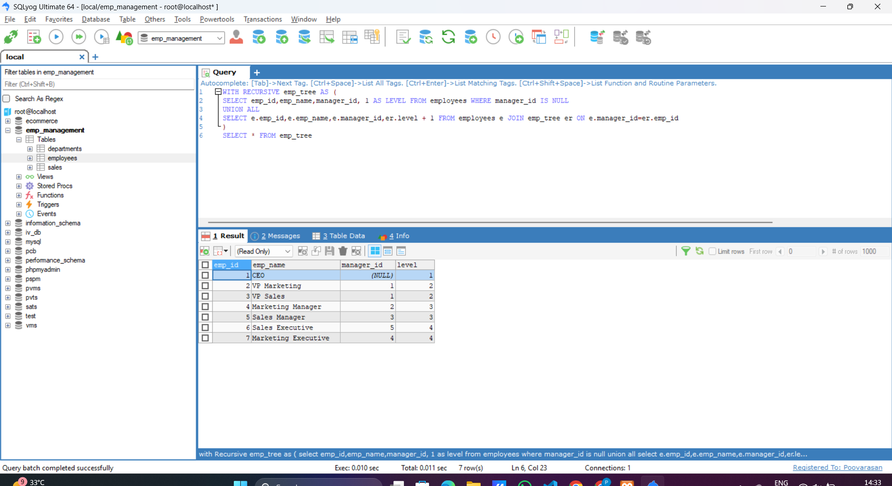
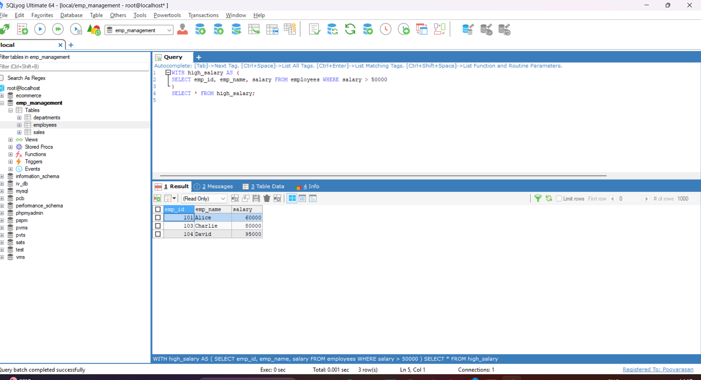

# Task - Working with Common Table Expressions (CTEs) and Recursive Queries

- Simplifying complex queries and process hierarchical data using CTEs.

## what is Common Table Expressions (CTEs)?

- A CTE is a temporary result set that you can reference within a SELECT, INSERT, UPDATE, or DELETE query. It makes complex queries more readable and modular.

- Syntax of CTE.
```
WITH cte_name AS (
  SELECT ...
)
SELECT * FROM cte_name;
```

## Recursive Common Table Expressions

- A recursive CTE is a CTE that calls itself to repeatedly perform a task — usually for hierarchical data, like an employee-manager relationship or category tree.

- Below SQL query is the example for Recursive CTE. This starts with top-level managers and keeps adding their subordinates.

```
WITH RECURSIVE emp_tree AS (
SELECT emp_id,emp_name,manager_id, 1 AS LEVEL FROM employees WHERE manager_id IS NULL
UNION ALL
SELECT e.emp_id,e.emp_name,e.manager_id,er.level + 1 FROM employees e JOIN emp_tree er ON e.manager_id=er.emp_id)
SELECT * FROM emp_tree
```




## Non-Recursive Common Table Expressions

- A non-recursive CTE is a CTE that does not refer to itself. It is used to break down complex queries into simpler, readable parts.
- Below is the example of Non-Recursive CTE.
- It will returns the employee details who's salary is more than 50000.

```
WITH high_salary AS (SELECT emp_id, emp_name, salary FROM employees WHERE salary > 50000) SELECT * FROM high_salary;
```

