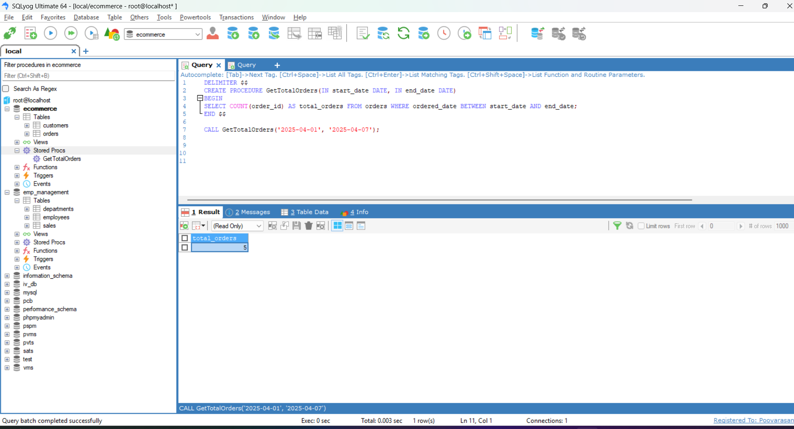

# Task - Working with Stored Procedures and User Defined Functions

- Encapsulate business logic using stored procedures and functions.

## Stored Procedures

- Stored Procedures are used to execute reusable business logic with SQL statements.
- Below is the example of Stored Procedures.
- Create a stored procedure to get the total number of orders placed between two dates (`start_date` and `end_date`).
- It should return the total number of orders placed in that date range.

```
DELIMITER $$
CREATE  PROCEDURE `GetTotalOrders`(IN start_date DATE, IN end_date DATE)
BEGIN 
SELECT COUNT(order_id) AS total_orders FROM orders WHERE ordered_date BETWEEN start_date AND end_date;
END$$
DELIMITER ;
```



## User Defined Functions

- User-Defined Functions return a value (scalar or table) for use within queries, mainly for calculations or formatting.
- Below SQL Query is the example of User Defined Functions.
- Create a function to calculate the discount based on the product price.
- If the product price is greater than 15000, the discount is 10% of the product price.
- Otherwise, the discount is 5% of the product price.

```
DELIMITER $$
CREATE FUNCTION `calculate_discount`(product_price DECIMAL(10,2)) 
RETURNS DECIMAL(10,2)
BEGIN
DECLARE discount DECIMAL(10,2);
IF product_price>15000 THEN
	SET discount = product_price*0.10;
ELSE 
    SET discount = product_price * 0.05;
END IF;
RETURN discount;
END$$

DELIMITER ;
```

